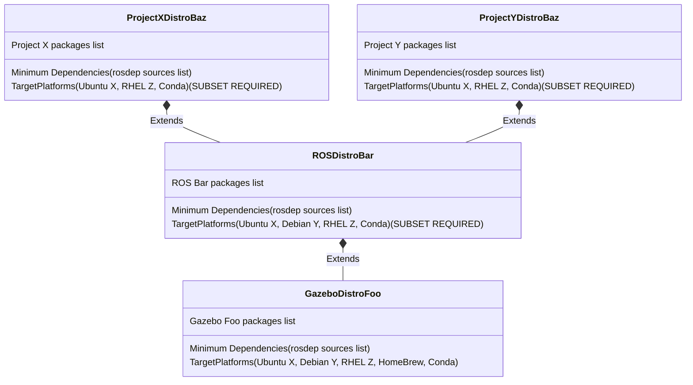

## Abstract

The Distribution File has been established as an effective way to coordinate the distributed release of a large set of packages.
These have been effectively defined and used in REP 141 and REP 143 (TODO LINKS).
However as the community is growing we are encountering several use cases were the current system is cost prohibitive to use.

The implementation currently supports the main ROS distributions well as well.
And it supports fully forking as an entire project which is valuable for deploying in high criticality situations.
However full forks do not guarentee compatibilty with other projects.
To that end we look to enable a new concept of extending a rosdistro.

At it's core a rosdistro is a collection of software packages with an agreed upon minimum dependency level. 
Currently these dependencies are defined through the rosdep database as well as the platform guidances captured in REP 2000.
There's potentially a better locations for that but that's separate.

What this REP is proposing is to enable one rosdistro to declare that it extends another rosdistro.
This will mean that in the downstream distros they will inherit the minimum dependencies of the upstream distro.
And simultaneously all of the packages from the upstream distro will be available as if they were in the derived distribution. 

This will enable independent projects to leverage the rosdistro infrastructure as long as they are willing to coordinate their minimum dependencies.
Examples of projects like this can include ROS and Gazebo, where the dependencies are already managed, but in addition the packages are manually synchorinized between the distros.

Furthermore this will enable other projects to leverage the community work and explicitly extend it and release things separately.
This is expected to unlock both additional open source projects as well as well as commercial developers.
The extended distros will be able to leverage the full open source release pipeline if they would like, but they can also do things like explicitly focus down the support targets or other elements of the distro.
However the core element of it is that as long as the derived distros extend the same compatible base distros and their communication dependencies are shared they will be compatible and be able to work together on a system.

In the abstract this is moderately simple, but the challenges will be in how to coordinate support for cross references between the distros as well as conflict detection and defining how different distributions channels interact.
To get the most value out of this we want to be able to leverage existing shared binary distributions without needing to rebuild all the content so this will include metadata to control the appropriate logic to clearly define how caching will work.

In addition a common use case can be to knockout and replace content for potentially a specific requirement although this will potentially break compatibility it should be possible to do with the caveats that compatibiltiy will no longer be guarenteed.

There is also the potential that the ROS project may want to choose to separate the releases into tiers of releases which can differentiate is a similar way to Ubuntu does main universe multiverse differentation. 

## Motivation 




## Specification


### Distribution File Version 3

Extending the definion in REP-0143

* Add an optional `extends` element which is an array of items with the following required elements
    * `index url` - The maintained URL to find the index which contains the distro (requires index v4)
    * `distro_name` - The distro name to use inside the index
    * `extension_method` - Either `binary_import` which implies that the packages will be used as distributed upstream with their original name, or `source_rebuild` which will cause the packages to be rebuilt and redistributed with the derived distro's name. Aka ros-rolling-foo imported to bar distro will be rebuild ros-bar-foo with the same source as ros-rolling-foo.


* Add an optional `dependencies` array, with the following required in the elements if the elements are present
  * `rosdep_sources_list_url` pointing to a rosdep sources list
  * `rosdep_minimum_target_platforms` An array of target platform keys in the rospkg definition  (TODO define here)

As an example ROS Kilted will use:
```yaml
  dependencies:
  - * rosdep_sources_list_urls:  
    - yaml https://raw.githubusercontent.com/ros/rosdistro/master/rosdep/base.yaml
    - yaml https://raw.githubusercontent.com/ros/rosdistro/master/rosdep/python.yaml
    - yaml https://raw.githubusercontent.com/ros/rosdistro/master/rosdep/ruby.yaml
    * rosdep_minimum_target_platforms:
    - ubuntu:noble
    - debian:bookwork
    - rhel:9
    - windows:10

```

To indidcate that these rosdep sources will be maintained for this distro.
If the distro is EOL'd then these should be changed to be snapshots instead of actively maintained urls.

### Release Build File Version 3

This extends Release Build File Version 1 defined in REP-0141

If necessary we will extend this file for the binary imports it's likely that the repositories and snapshots will be adaquate.
For the source based imports the existing build file options should be inhereted.

The implementation should be updated to warn if the target platforms is outside of the set that the base distros have declared. 


## Rationale

TODO [Describes why particular design decisions were made.]

## Backwards Compatibility

TODO

## Implmenetation

A lot of this work is in the implementation details for the binary builds.

This will require updates and extensions to many of the tools throughout the ecosystem
* rosdistro library - parsing the files and answering queries about the packages, catch exceptions
* rosdistro cache - respect the caching, chain the caches
* rosinstall_generator - traverse across distro boundaries appropriately
* ros_buildfarm - leverage the cache and rosdistro libraries to build across the multiple distros, for each platform type
* rosdep work better with rosdistro embedded mappings, or other tools to make sure rosdep sources are up to date on the system separately and not change rosdep source logic. 


## How to use the template

Follow these steps to use the template and begin drafting your proposed REP.

7. Add the full URL to all relevant discussion threads on the Open Robotics Discourse to the `Discussion` field.
   Do not use link shorteners.
   If no discussion thread yet exists, use `Pending` for this field, but remember to update the field with the discussion thread links once they become available, or your REP will not be accepted.
12. Fill in the `Supersedes` field, if your REP will make one or more existing Finalized REPs obsolete.
13. Write the Abstract, Motivation, Specification, Rationale, and any other necessary sections for your REP.
    Replace all the existing text from the original file with your own.
14. Create a pull request against the [REPs repository](https://github.com/openrobotics/reps) to add your REP as a draft.

Other than the Header, which must be in [RFC 2822](https://datatracker.ietf.org/doc/html/rfc2822.html) format, all content in the REP’s source Markdown file must comply with the [GitHub Flavored Markdown Specification](https://github.github.com/gfm/).
Within the file, lines must not be wrapped, and each sentence must start on a new line (i.e. each sentence is on its own line).
This is necessary to ensure pull request diffs are sufficiently readable.

TODO Sections below

`# How to Teach This`

`[For a REP that adds or changes user-facing behaviour, include a section on how to effectively teach both new and experienced users how to apply the REP.]`

`# Implementation`

`[The implementation must be completed before the REP can be moved to the Finalized state, but it does not need to be completed for the REP to be Accepted]`

`# Rejected Ideas`

`[Throughout the discussion of a REP, ideas may be proposed which are ultimately rejected.]`

`# Known Issues`

`[While a Draft REP is being worked on and discussed, ideas can come up that warrant further discussion or require additional work.]`

## License

This document is marked CC0 1.0 Universal.
To view a copy of this mark, visit [https://creativecommons.org/publicdomain/zero/1.0/](https://creativecommons.org/publicdomain/zero/1.0/).
