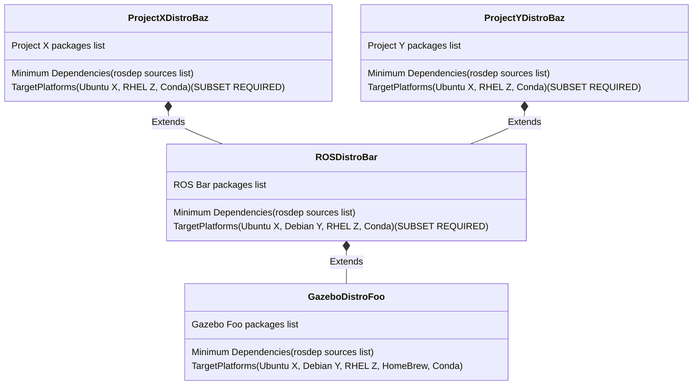

## Abstract

The Distribution File has been established as an effective way to coordinate the distributed release of a large set of packages.
These have been effectively defined and used in REP 141 and REP 143 (TODO LINKS).
However as the community is growing we are encountering several use cases were the current system is cost prohibitive to use.

The implementation currently supports the main ROS distributions well.
And it supports fully forking as an entire project which is valuable for deploying in high criticality situations.
However full forks do not guarentee compatibilty with other projects.
To that end we look to enable a new concept of extending a rosdistro.

At it's core a rosdistro is a collection of software packages with an agreed upon minimum dependency level. 
Currently these dependencies are defined through the rosdep database as well as the platform guidances captured in REP 2000.
There's potentially a better locations for that but that's separate.

What this REP is proposing is to enable one rosdistro to declare that it extends another rosdistro.
This will mean that in the downstream distros they will inherit the minimum dependencies of the upstream distro.
And simultaneously all of the packages from the upstream distro will be available as if they were in the derived distribution. 

This will enable independent projects to leverage the rosdistro infrastructure as long as they are willing to coordinate their minimum dependencies.
Examples of projects like this can include ROS and Gazebo, where the dependencies are already managed, but in addition the packages are manually synchorinized between the distros.

Furthermore this will enable other projects to leverage the community work and explicitly extend it and release things separately.
This is expected to unlock both additional open source projects as well as well as commercial developers.
The extended distros will be able to leverage the full open source release pipeline if they would like, but they can also do things like explicitly focus down the support targets or other elements of the distro.
However the core element of it is that as long as the derived distros extend the same compatible base distros and their communication dependencies are shared they will be compatible and be able to work together on a system.

In the abstract this is moderately simple, but the challenges will be in how to coordinate support for cross references between the distros as well as conflict detection and defining how different distributions channels interact.
To get the most value out of this we want to be able to leverage existing shared binary distributions without needing to rebuild all the content so this will include metadata to control the appropriate logic to clearly define how caching will work.

In addition a common use case can be to knockout and replace content for potentially a specific requirement although this will potentially break compatibility it should be possible to do with the caveats that compatibiltiy will no longer be guarenteed.

There is also the potential that the ROS project may want to choose to separate the releases into tiers of releases which can differentiate is a similar way to Ubuntu does main universe multiverse differentation.
This may be particularly valuable if the different tiers potentially have different supported Target Platforms.

## Motivation 

The goal of this extension is to enable projects to collaborate together more easily.
I will flesh out two primary use cases.

### Use Case 1 - Public Project Coordination

The first is to enable better collaboration between our existing open source projects.
Two major projects that can be represented as distros are the ROS and Gazebo projects.
ROS is already managed explicitly as a distro.
Gazebo is also effectively managed as a distro, but is not formalized in the same way.
And when ROS imports Gazebo as a dependency it's done manually. 
The goal of this proposal is to enable this dependency to be explicitly modelled and automate that import and coordination process.
Furthermore we can also reduce the need for very similar test and build infrastructure.

The goal result of this is that we can: 

* formalize the Gazebo Rotary release as a distro.
* Create and build releases using the rosdistro tooling and infrastructure
* Make ROS Rolling depend on Gazebo Rotary, automatically importing the built binaries from the latest (explicitly imported) sync release.
  * As it's explicitly imported it can also be rolled if there's an issue.
  * The binaries will be the same
  * Queries for Gazebo Rotary packages in ROS Rolling will alias transparently through so that the user doesn't need to know which layer it came from.
  * This brings together both rolling releases conveinently.
* When Gazebo creates Gazebo M and ROS M is created it can be pointed at Gazebo M while Rolling continues to point to Rotary.


### Use Case 2 - Externally managed Distro Extension

The above use case covers the coordination of major projects between each other.
There's a closely related use case which is that of an external maintainer who wants to maintain packages that are compatible with the public distribution but keep them in a separate source. 
The intent is for these packages to be used with the upstream repositories, but the extension repository is maintained by the third party.
There are several reasons why it might make sense to do this separately. 

* The packages need to follow a different release cadence.
* The packages need a different trust level.
* The packages are not in compliance with the upstream distro's policies or governance. For example a potential example might be a non OSI approved license. The packages are too large for standard releases, or need special hardware to be built.

To utilize these externally managed distros they will have to explicitly add and enable the additional source repositories on their system because they need to be explicitly trusted by the system administrator.

Community members that might fall into this case can include: 

* Releasing a custom hardware driver that they will redistribute to their customers, but it has a binary blob driver.


### Use Case 3 - Private Distro Extension

There are also many cases when someone may want to extend a ROS Distro in a binary compatible way but keep the results private.
Common use cases for this include:

* Commercial software companies (e.g. with the results avilable behind some sort of paywall or subscription mechanism.)
* Internal customer use only. (e.g. Hosted on an intranet or VPN)
* Creating a set of packages for customized support of a robot for internal usage or private coordinated development.
* If we do this well enough we would enable a lab manager or TA to create an example scenario for a project, and then each student would be able to create their own extended rosdistro for their projects, so that the students can rely on binary builds of all the core elements as well as the shared packages and only need to build their own packages.

To enable this the private distro maintainer will setup their distro to extend a public one and produce the extra private packages which are compatible with the upstream users.
In the same way as the above use case the user will have to enable the extra source repository as well as enable the access in whatever mechanism is implmeented by the user.
Access control is not proscribed or provided by rosdistro, that is necessary for the distro maintainer to setup as best fits their application.


### Use Case 4 - Private Distro Rebuild + Extend

If instead of using the binary_import mechanism and only building new packages based on the binary builds, a maintainer could select a source_rebuild extension mechanism.
This might be chosen for improved trust of the binaries that are produced at the cost of additional computation.
With appropriate caching this can also enable reproduction of the builds in the case that an upstream resources disappears.

This does not preclude extending so additional packages could also be included in the distro.
The rebuilt packages would be expected to be generally compatible with the upstream packages.
The rebuilt packages however would be named with the extension distro's name not the upstream distro's name because it would be possible to end up with binary incompatible packages. 
This also unlocks the ability to override a sepecific package in the upstream distro.
Doing something like this would be potentially breaking for compatibility (both ABI but now also API), but with the new name the maintainer is empowered to create their own expectations for compatiblity and stability. 


TODO FIxed cadence, bad for everyone
QA/Testing cycle

Future Daily testing



```mermaid

classDiagram
    ProjectXDistroBaz *-- ROSDistroBar : Extends
    ProjectYDistroBaz *-- ROSDistroBar : Extends
    ROSDistroBar *-- GazeboDistroFoo : Extends


    class ProjectXDistroBaz{
      Project X packages list
      Minimum Dependencies( rosdep sources list)
      TargetPlatforms(Ubuntu X, RHEL Z, Conda) (SUBSET REQUIRED)
    }
    class ProjectYDistroBaz{
      Project Y packages list
      Minimum Dependencies( rosdep sources list)
      TargetPlatforms(Ubuntu X, RHEL Z, Conda) (SUBSET REQUIRED)
    }
    class ROSDistroBar{
      ROS Bar packages list
      Minimum Dependencies( rosdep sources list )
      TargetPlatforms(Ubuntu X, Debian Y, RHEL Z, Conda) (SUBSET REQUIRED)
    }
    class GazeboDistroFoo{
      Gazebo Foo packages list
      Minimum Dependencies( rosdep sources list )
      TargetPlatforms(Ubuntu X, Debian Y, RHEL Z, HomeBrew, Conda)
    }

```

## Specification


### Distribution File Version 3

Extending the definion in REP-0143

* Add an optional `extends` element which is an array of items with the following required elements
    * `index url` - The maintained URL to find the index which contains the distro (requires index v4) (Optional, if not set look in current location)
    * `distro_name` - The distro name to use inside the index
    * `extension_method` - Either `binary_import` which implies that the packages will be used as distributed upstream with their original name, or `source_rebuild` which will cause the packages to be rebuilt and redistributed with the derived distro's name. Aka ros-rolling-foo imported to bar distro will be rebuild ros-bar-foo with the same source as ros-rolling-foo.

Packages found in the upstream repositories first will take precedence.
So the first extends distro with a matching package will match.
Where content in the distro itself takes precedence over any package in the extensions.

// TODO maybe add an option no-package-masking to throw an error if there is a collision in the case that you want to guarantee compatibility.


* Add an optional `dependencies` array, with the following required in the elements if the elements are present
  * `rosdep_sources_list_url` pointing to a rosdep sources list 
  * `rosdep_minimum_target_platforms` An array of target platform keys in the rospkg definition, OS_NAME:OS_VERSION (TODO Check OS_CODENAME) 

As an example ROS Kilted will use:
```yaml
  dependencies:
  - * rosdep_sources_list_urls:  
    - yaml https://raw.githubusercontent.com/ros/rosdistro/master/rosdep/base.yaml
    - yaml https://raw.githubusercontent.com/ros/rosdistro/master/rosdep/python.yaml
    - yaml https://raw.githubusercontent.com/ros/rosdistro/master/rosdep/ruby.yaml
    * rosdep_minimum_target_platforms:
    - ubuntu:noble
    - debian:bookwork
    - rhel:9
    - windows:10

```
// Allows bloom to only use the official ones
// TODO enables dynamics rpm work more, especially grabbing snapshots

To indidcate that these rosdep sources will be maintained for this distro.
If the distro is EOL'd then these should be changed to be snapshots instead of actively maintained urls.

It is also strongly recommended to point extensions to snapshots of distros when doing a `binary_import` so that resources can be invalidated appropriately and trigger rebuilds as necessary.

### Release Build File Version 3

This extends Release Build File Version 1 defined in REP-0141

If necessary we will extend this file for the binary imports it's likely that the repositories and snapshots will be adaquate.
For the source based imports the existing build file options should be inhereted.

For `binary_import` the binary artifacts place to import is going to be necessary to bring in. This may make sense to keep in the implementation specific _config. 

The implementation should be updated to warn if the target platforms is outside of the set that the base distros have declared. 


// TODO encode binary package name transformation
We want to be able to support ros-DISTRO-PACKAGE-NAME (substituting underscores for dashes)


Binary artifact name template f`ros-{distro}-{package_name.substitue('_', '-')}`

ALternative for gazeo

Some set of avialble variables
* distro
* package_name
* python_version
* distribution_status
* distribution_type


## Binary Import Behavior

When extending with the `binary_import` mechanism the upstream binary packages will be directly imported as they are already distributed and will be used without rebuilding.
This means that there will be no renaming and packages will still use their existing names and installation space.

For example if you make `kinematic` which `binary_imports` from `kinetic` packages from kinetic will retain `ros-kinetic-PKG-NAME` as their binary package and will install into `/opt/ros/kinetic`.
Packages from `kinematic` would be built into `ros-kinematic-PKG-NAME` and install into `/opt/ros/kinematic` but they will automatically source any dependencies in `/opt/ros/kinetic` transparently.

When you look up a package with rospkg or rosindex it will traverse both installation locations for package names.
rosdep will need to be extended to be aware of which rosdistro the underlying package comes from to support installing with the right alias. Both of these functionalities are expected to be provided by the `rosdistro` library.


TOOD Potentially use the snapshotting: https://github.com/ros/rosdistro/pull/50112

## Source Rebuild Behavior


## Rationale

TODO [Describes why particular design decisions were made.]

## Backwards Compatibility

All of the new fields are optional and they will not be necessary unless the new extension mechanisms are used.
In the case that dependencies are not declared they will be assumed to be blank and that there are no required dependencies.

## Implmenetation

A lot of this work is in the implementation details for the binary builds.

This will require updates and extensions to many of the tools throughout the ecosystem
* rosdistro library - parsing the files and answering queries about the packages, catch exceptions
* rosdistro cache - respect the caching, chain the caches
* rosinstall_generator - traverse across distro boundaries appropriately
* ros_buildfarm - leverage the cache and rosdistro libraries to build across the multiple distros, for each platform type
* rosdep work better with rosdistro embedded mappings, or other tools to make sure rosdep sources are up to date on the system separately and not change rosdep source logic. 


## How to use the template

Follow these steps to use the template and begin drafting your proposed REP.

7. Add the full URL to all relevant discussion threads on the Open Robotics Discourse to the `Discussion` field.
   Do not use link shorteners.
   If no discussion thread yet exists, use `Pending` for this field, but remember to update the field with the discussion thread links once they become available, or your REP will not be accepted.
12. Fill in the `Supersedes` field, if your REP will make one or more existing Finalized REPs obsolete.
13. Write the Abstract, Motivation, Specification, Rationale, and any other necessary sections for your REP.
    Replace all the existing text from the original file with your own.
14. Create a pull request against the [REPs repository](https://github.com/openrobotics/reps) to add your REP as a draft.

Other than the Header, which must be in [RFC 2822](https://datatracker.ietf.org/doc/html/rfc2822.html) format, all content in the REP’s source Markdown file must comply with the [GitHub Flavored Markdown Specification](https://github.github.com/gfm/).
Within the file, lines must not be wrapped, and each sentence must start on a new line (i.e. each sentence is on its own line).
This is necessary to ensure pull request diffs are sufficiently readable.

TODO Sections below

`# How to Teach This`

`[For a REP that adds or changes user-facing behaviour, include a section on how to effectively teach both new and experienced users how to apply the REP.]`

`# Implementation`

`[The implementation must be completed before the REP can be moved to the Finalized state, but it does not need to be completed for the REP to be Accepted]`

`# Rejected Ideas`

`[Throughout the discussion of a REP, ideas may be proposed which are ultimately rejected.]`

`# Known Issues`

`[While a Draft REP is being worked on and discussed, ideas can come up that warrant further discussion or require additional work.]`

## License

This document is marked CC0 1.0 Universal.
To view a copy of this mark, visit [https://creativecommons.org/publicdomain/zero/1.0/](https://creativecommons.org/publicdomain/zero/1.0/).
