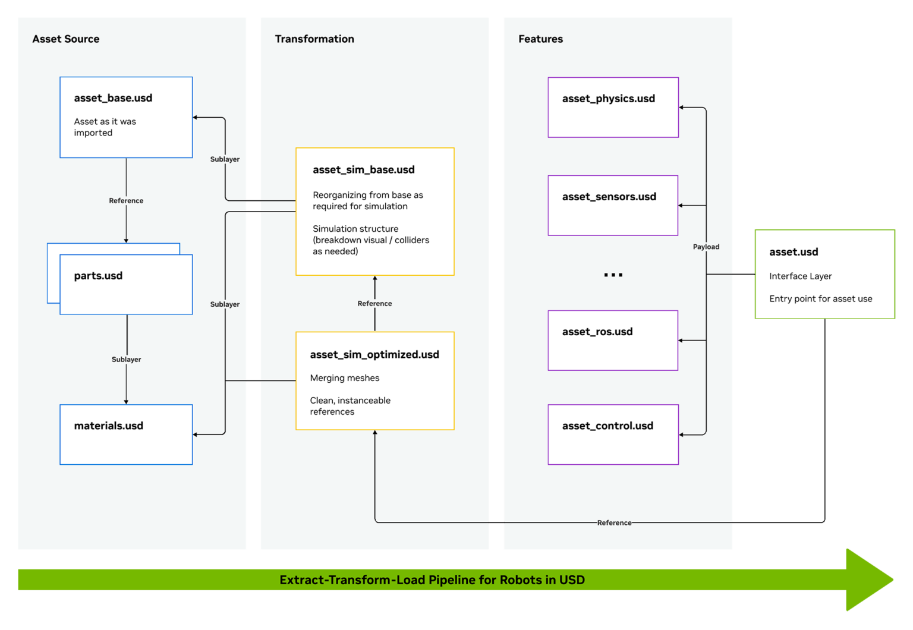

# REP XXXX -- OpenUSD Conventions for Simulation Asset Interoperability

| Field | Value |
| :--- | :--- |
| **REP** | XXXX |
| **Title** | OpenUSD Conventions for Simulation Asset Interoperability |
| **Authors** | Adam Dabrowski, Mateusz Zak (Robotec.ai) |
| **Status** | Draft |
| **Type** | Standards Track |
| **Content-Type** | text/markdown |
| **Created** | 2026-03-03 |
| **Requires** | REP 103, REP 105, OpenUSD Core Spec v1.0.1 |

## Abstract

This REP defines a standard schema and strict profile of OpenUSD (Universal Scene Description) for the interchange of robotics simulation assets. The scope includes robots, sensors, static environments (e.g., warehouse racks), and dynamic props. This REP aims to ensure that a single asset functions consistently across:

1.  **Simulation and physics engines** (Gazebo, Isaac Sim, Newton, Genesis, MuJoCo, O3DE).
2.  **Runtime integrations** (ROS 2 Interfaces).
3.  **Converters and web visualization** (especially glTF 2.0 conversion).

To achieve this, the specification addresses three key areas:
*   **Section 1** adopts existing upstream standards and recommendations (AOUSD, ASWF, NVIDIA) to establish a baseline for correct simulation assets.
*   **Section 2** defines novel, declarative API schemas for ROS 2 interfaces to ensure engine-agnostic runtime behavior.
*   **Section 3** defines a strict interoperability profile to support export pathways to other formats, ensuring compatibility with standards like glTF 2.0.

## Motivation 

The ROS ecosystem chiefly relies on URDF and SDF for describing robots and environments. These formats are almost entirely confined to the ROS and Gazebo ecosystems. OpenUSD has emerged as an industry standard supported by a multitude of tools and allows artists to collaborate with simulation engineers without problematic conversions between a variety of 3D and XML formats. Ensuring OpenUSD works well with ROS integrations across robotics simulators will increase ecosystem interoperability and strengthen ROS's position in physical AI workflows such as synthetic data and generative pipelines. OpenUSD is a powerful format with an extensible architecture allowing it to capture all the semantics of other popular formats.

While OpenUSD adoption is growing quickly, only the core standard specification has been ratified so far, leaving most of what's interesting for robotics uncovered. OpenUSD lacks standardized semantic representations for ROS 2 interfaces and standard rules for mapping to ROS concepts such as frames and TF trees. OpenUSD's flexibility also permits practices that degrade interoperability, such as proprietary extensions, defining execution instead of intent, and overfitting to particular workflows.

OpenUSD is championed by the Alliance for OpenUSD (AOUSD) and the ASWF USD Working Group. NVIDIA also plays a key role both as a founding member of AOUSD and in developing OpenUSD for robotics through Omniverse, Isaac Sim and Newton. This REP builds on top of great work done by all these entities, extending it by addressing what is not yet standardized but urgently needed for OpenUSD interoperability in the ROS simulation ecosystem, and standardizing against practices that result in a vendor lock-in. As such, this REP is designed to adapt upstream standards for the ROS community, while serving as a reference to influence future decisions by AOUSD and ASWF.

## Specification

The keywords "must", "must not", "required", "shall", "shall not", "should", "should not", "recommended", "may", and "optional" in this document are to be interpreted as described in RFC 2119.

---

## 1. Simulation Assets Baseline

This section confirms and standardizes prior work and recommendations for OpenUSD simulation assets. It draws from the Alliance for OpenUSD (AOUSD), the ASWF USD Working Group, and NVIDIA Asset Requirements. 

*Note: As AOUSD domain-specific working groups formalize physics and robotics specifications, recommendations in this section are subject to evolution and alignment.*

### 1.1 Coordinate Systems & Units
To ensure alignment with ROS standards (REP 103) and stability across solvers:

*   **Units:** All linear dimensions in the USD stage must be defined in meters, and all mass values in kilograms.
    *   `metersPerUnit` and `kilogramsPerUnit` metadata must be set to `1.0` in the root layer.
    *   Fallback: while interoperable assets must adhere to 1.0, simulators and converters importing general OpenUSD assets must read these metadata tokens and  apply the appropriate scaling factors to all derived spatial and physical quantities (e.g., coordinates, torque, stiffness, inertia) at load time
*   **Up-Axis & Chirality:** The stage `upAxis` must be set to `"Z"`. Assets must follow the strict ROS Right-Handed coordinate convention: X-forward, Y-left, Z-up.
*   **Root Transforms:** Assets must not rely on root-node rotations (e.g., `xformOp:rotateX = -90`) to align geometry. Points and normals should be transform-applied (frozen) to Z-up at the source level.
*   **Asset Pivots:** For assets intended to be placed on the ground (e.g., warehouse racks), the root origin should be located at the bottom-center of the asset bounding box (Z=0) to facilitate predictable drag-and-drop scene composition in simulators. Mobile bases should adhere to REP 105 origin conventions.

### 1.2 Asset Structure & Composition
This REP adopts the ASWF Guidelines for Structuring USD Assets.

#### 1.2.1 The Composition Model
*   **Components:** Atomic assets (e.g., a `LidarSensor`, a `Box`) must have `kind="component"` on their root prim.
*   **Assemblies:** Aggregates (e.g., a `Warehouse` containing racks) must have `kind="assembly"` or `kind="group"`.
*   A `component` must not contain another `component`: if finer organizational granularity is required, authors must use kind="subcomponent" allowing converters to easily identify the "atomic units" of the scene.

#### 1.2.2 Composition Arcs (LIVRPS Constraints)
To guarantee that simulation assets remain self-contained, portable, and predictable across different simulator parsers, asset authors must adhere to the following constraints regarding OpenUSD's LIVRPS composition arcs:
*   **[L] Local:** Primary authoring of overrides and properties on the asset is fully supported.
*   **[I] Inherits & [S] Specializes:** Asset authors should not rely on `Inherits` or `Specializes` arcs for core robot kinematics, physics APIs, or ROS schemas when distributing standalone assets. These arcs create hard dependencies on external class hierarchies; if a simulator's environment lacks the base class definitions, the asset will fail to parse correctly.
*   **[V] VariantSets:** Permitted and encouraged for asset reusability (see Section 1.2.3).
*   **[R] References:** Permitted for logical assembly (e.g., composing a robot by referencing an independent `arm.usd` and `base.usd`).
*   **[P] Payloads (The Payload Pattern):** Heavy data (high-resolution meshes, point clouds, large textures) must be referenced via Payloads rather than standard References. 
    *   Payloads must not gate joint or link prims themselves. The kinematic topology (Prims bearing `PhysicsRigidBodyAPI`, `PhysicsJoint` schemas, and `Ros2*API` schemas) must reside in the primarily loaded scene graph (e.g., via Local authoring or standard References). 
    *   The Payload should solely encapsulate the nested geometric and material data. This enables ROS parsers and web converters to traverse the lightweight kinematic tree efficiently without loading heavy buffers.

#### 1.2.3 Variants and Reusability
OpenUSD `VariantSets` are the normative mechanism for asset reusability (e.g., encapsulating multiple furniture styles, different robot end-effectors, or optional sensor suites within a single asset).
*   **Default Variant Fallback:** Any asset utilizing `VariantSets` must author a default variant selection. This ensures that if the asset is loaded by a simulator or CI/CD pipeline without explicit variant overrides, it resolves to a valid, predictable physical and visual state.
*   **ROS Interface Resolution:** A change in a variant selection may add or remove Prims containing `Ros2*API` schemas (e.g., swapping a generic robot head for a sensor-equipped head). Simulators and tooling must only evaluate and spawn ROS interfaces that are active within the currently resolved variant state of the stage.

#### 1.2.4 Asset Management & FileFormat Plugins
*   **Path Resolution:** Internal references must use relative paths (`./geo/mesh.usdc`). For distributed, highly interoperable assets, all file dependencies should be self-contained and rely exclusively on relative paths.
*   **ROS packages:** External dependencies to other ROS packages must use the package:// URI scheme, and should be contained in ROS-specific .usd files in the ETL pipeline. Asset authors must be aware that resolving these URIs requires the host simulator or tool to implement a custom OpenUSD ArResolver plugin. Absolute paths and proprietary schemes (e.g., omniverse://) are strictly prohibited in distributed assets.
*   **Native Composition vs. Custom Prefabs:** The use of custom or vendor-specific string attributes (e.g., `custom string my_sim:prefabPath = "robot.usd"`) to dynamically load, instantiate, or compose assets at runtime is strictly prohibited for interoperable assets. Asset composition must rely purely on native OpenUSD references or payloads.
*   **FileFormat Plugins:** OpenUSD supports FileFormat plugins (e.g., MuJoCo's `usdMjcf` plugin) to dynamically translate legacy formats into USD stages at runtime. While these plugins are recommended for import pathways, this REP governs the *resulting in-memory OpenUSD data*. Plugins interfacing with the ROS 2 ecosystem must generate stages that conform to the physical hierarchies and API schemas defined in this document.

#### 1.2.5 ROS-Compatible Identifiers
OpenUSD natively enforces strict naming for Prims (they must start with a letter or underscore, followed by alphanumeric characters or underscores: [a-zA-Z_][a-zA-Z0-9_]*). This natively aligns with ROS conventions. Furthermore, Prim names intended to map directly to ROS TF Frames must not contain spaces or special characters that could violate downstream ROS 2 lexical rules.

### 1.3 Physics & Kinematics

*   **Rigid Body Hierarchy:** Assets should utilize Logical Nesting to represent kinematic chains (e.g., `Forearm` is a child of `UpperArm`). This preserves the Scene Graph for TF tree generation and ensures compatibility with parsers expecting URDF/SDF-like topologies (e.g., MuJoCo).
    *  Simulators that require flat hierarchies are responsible for flattening the graph at import time. The asset itself must remain logically nested.
*   **Joint Placement:** While `UsdPhysicsJoint` prims rely on relational targeting (`body0` and `body1`) rather than hierarchy, asset authors should place the Joint prim as a sibling adjacent to the child link it connects, within the scope of the parent link. This ensures self-contained modularity.
*   **Articulation Roots:** A composed simulation stage must contain at most one `PhysicsArticulationRootAPI` per connected kinematic tree. 
    *   Assets (e.g., a modular gripper) should be self-contained with an articulation root for standalone use. 
    *   When composed into a larger kinematic tree, the composing stage should use the OpenUSD list-edit operation `delete apiSchemas = ["PhysicsArticulationRootAPI"]` to prune nested articulation roots. This prevents reduced-coordinate physics solvers from fracturing the robot.
*   **Loop Closures:** Articulations must form a spanning tree. Joints introducing loop-closing constraints (e.g., parallel linkages) must use the newly introduced `RoboticsLoopClosureAPI` marker schema.
*   **Mass Properties:** Assets and simulators must follow `UsdPhysicsMassAPI` guidelines. Dynamic bodies must define a strictly positive mass (mass > 0). Setting mass = 0 to imply infinite/static mass violates the UsdPhysics specification, which ignores 0.0 and falls back to a computed default mass. Instead, authors must use standard mechanisms for non-dynamic bodies:
    * Static Environments: Fixed props (e.g., walls, racks) must possess a PhysicsCollisionAPI but omit the PhysicsRigidBodyAPI. OpenUSD implicitly treats these as having zero velocity and infinite mass.
    * Robot Anchors: A fixed robot base must have a valid mass > 0 and be anchored via a UsdPhysicsFixedJoint with an empty physics:body0 relationship (which natively represents the world).
    * *Kinematic Bodies:* Moving bodies that are animated but not dynamically driven by physics should set the physics:kinematicEnabled attribute to true.
    * *Dummy Frames:* Non-physical dummy frames (e.g., `camera_optical_frame`) must not possess a `PhysicsRigidBodyAPI`. They should be tracked using the `Ros2FrameAPI` as defined in Section 2.8.
*   **Inertia Representation:** Unlike URDF and SDFormat's 6-value symmetric matrix, OpenUSD requires an eigendecomposed inertia tensor. Converters must mathematically decompose the source matrix into physics:diagonalInertia (eigenvalues) and physics:principalAxes (quaternion). This native decomposed form is the strict single source of truth; custom 6-value array attributes must not be authored or parsed.

#### 1.3.1 Collisions & The Dual-Fidelity Pattern
Collision geometries should explicitly specify `purpose="guide"` and `physics:approximation="none"`. To ensure assets function across both standard physics engines and advanced contact-rich solvers (e.g., Newton), assets should employ a "Dual-Fidelity Pattern" utilizing a `collision_fidelity` OpenUSD `VariantSet`:
1.  **Baseline Approximation (Default Variant):** The default variant must contain "convexHull" or primitive shapes.
2.  **Advanced Approximation (Optional Variant):** A secondary variant may contain high-fidelity concave trimeshes intended for Signed Distance Field (SDF) or Hydroelastic collision generation, provided the target simulator supports these paradigms.

#### 1.3.2 Visual Geometry & Level of Detail
Each link's visual and collision scopes should be organized as sibling children (e.g., `/{link}/visual`, `/{link}/collision`).

To ensure assets function across high-end renderers (Isaac Sim, O3DE), CPU-bound physics simulators (Gazebo, MuJoCo), and lightweight web viewers, assets should provide multiple geometric representations via a `visual_lod` VariantSet on the visual scope:
1.  **Medium (Default Variant):** Decimated geometry for real-time engines and standard simulation workloads.
2.  **High (Optional Variant):** Full-fidelity source geometry (e.g. CAD). Suitable for ray-traced rendering and high-end visualization.
3.  **Low (Optional Variant):** Aggressively simplified for web viewers, large-scale batch simulation, and GPU-instanced scenes (e.g., Genesis).

Collision meshes are not subject to visual LOD; their fidelity is governed by the `collision_fidelity` VariantSet (Section 1.3.1).

---

## 2. ROS 2 Integration Schemas

Neither OpenUSD nor glTF 2.0 currently standardize the specification of ROS interfaces. This section defines a set of declarative, engine-agnostic API schemas. Simulators are responsible for reading these schemas and generating their respective underlying execution logic.

A Prim acts as a single logical interface. If a sensor needs multiple interfaces (e.g., `image_raw` and `camera_info`), a child prim for each interface should be utilized.

### 2.1 Schema Isolation and Functional Layering (The ETL Pipeline)

To avoid "Unknown Schema" errors in standard 3D authoring tools (e.g., Blender, Maya) and to ensure assets remain modular, functional layering (Extract-Transform-Load) should be utilized for ROS 2 interfaces, physics, and simulator-specific tooling syntax. 

This REP endorses the ETL composition architecture developed collaboratively by NVIDIA, Intrinsic, and Disney Research for OpenUSD robotics assets.

*Figure 1: The Extract-Transform-Load (ETL) composition pipeline for OpenUSD robotics assets. Source: [NVIDIA Developer Blog](https://developer.nvidia.com/blog/using-openusd-for-modular-and-scalable-robotic-simulation-and-development/)*

As illustrated in Figure 1, assets should be divided into functional layers composed via References and Payloads:

*   **Asset Source & Transformation (The Base Layer):** The raw CAD data (`asset_base.usd`) is optimized into simulation-ready geometry (`asset_sim_optimized.usd`). This layer contains native OpenUSD schemas (`UsdGeom`, `UsdShade`).
*   **Features (The Domain-Specific Layers):** Domain metadata is isolated into specific overlay files that reference the Base Layer. For example, `asset_physics.usd` contains the rigid bodies and joints, while `asset_ros.usd` contains the `Ros2*API` schemas defined in this REP.
*   **Entry Point (`asset.usd`):** The final distributed asset is a lightweight interface layer that uses **Payloads** to load the Features. 
*   **Proprietary Layer:** Asset authors should avoid including heavy, simulator-specific implementations (e.g., proprietary execution graphs) within the interoperable asset package. If unavoidable, they must minimize this proprietary layer (e.g., `asset_isaac.usd`) to what is strictly necessary and keep it isolated as a separate Feature layer.

### 2.2 The ROS 2 Context (`Ros2ContextAPI`)
The root prim of a ROS-interfaced simulation asset may define its context namespace.
*   `string ros2:context:namespace`: Prefixes all topics within this scope (e.g., `/robot_1`). The namespace is additive in the asset hierarchy and with a top-level namespace set during simulation deployment (e.g., via the `SpawnEntity` service).
*   `int ros2:context:domain_id` (Optional): Overrides the default ROS Domain ID for interfaces descending from this context.
*   `string ros2:context:parent_frame` (Optional, Default: `"world"`): Defines the parent `frame_id` used when the simulator broadcasts the ground-truth transform of this context's root prim. It is only valid for the top-most context in the resolved USD Stage and ignored otherwise.

### 2.3 Interface Placement

ROS 2 interface schemas (`Ros2TopicAPI`, `Ros2ServiceAPI`, `Ros2ActionAPI`) must be applied to prims according to these placement rules:

*   **Robot-wide interfaces:** Aggregate interfaces spanning a kinematic tree (e.g., `JointState` publisher, `FollowJointTrajectory` server) must be placed on or directly beneath the prim bearing the `Ros2ContextAPI`.
*   **Sensor interfaces:** Localized interfaces (e.g., `Image`, `LaserScan`) must be placed on a child `UsdGeomXform` of the physical link. Multiple interfaces for the same sensor (e.g., `image_raw` and `camera_info`) must distribute them across separate child prims, one interface per prim.
*   **Interface prims must reside outside payloads.** Prims bearing `Ros2*API` schemas are part of the lightweight kinematic/interface graph and must be traversable without loading geometry payloads.

### 2.4 Interface Type Resolution & Naming
For all schema types (Topics, Services, Actions) defined below:
*   **Type Resolution:** Tooling and compliant simulators must attempt to resolve the `ros2:*:type` string (e.g., `sensor_msgs/msg/Image`) dynamically against the sourced ROS 2 environment. If the interface type is not found, the simulator must safely disable that specific interface, allow the rest of the asset to function normally, and emit a distinct warning/error.
*   **Name Validation:** All `ros2:*:name` values must strictly adhere to ROS 2 topic naming rules (alphanumeric, underscores, and forward slashes only; cannot start with a number).

### 2.5 Topic Interface (`Ros2TopicAPI`)
Applies to Prims that exchange streaming ROS data.

**Core Attributes (Required):**
*   `token ros2:topic:role`: Values: `["publisher", "subscription"]`.
*   `string ros2:topic:name`: The topic name relative to the active namespace.
*   `string ros2:topic:type`: The ROS message type.
*   `double ros2:topic:publish_rate`: Target publication frequency in Hz. Required for publishers; ignored for subscriptions.

**Quality of Service (QoS) Attributes:**
Maps directly to `rmw_qos_profile_t` policies. If an attribute is omitted, simulators must assume the specified defaults. *(Note: As per REP 2003, simulated sensors should default to `"system_default"` which maps to best-effort, while map publishers should use `"transient_local"`).*
*   `bool ros2:topic:qos:match_publisher` (Optional, Default: `false`). For subscriptions only. If `true`, the simulator bridge must attempt to use ROS 2 QoS matching to adapt to the discovered publisher, ignoring explicit reliability/durability settings.
*   `token ros2:topic:qos:reliability`: Values: `["system_default", "reliable", "best_effort"]`. (Default: `"system_default"`).
*   `token ros2:topic:qos:durability`: Values: `["system_default", "transient_local", "volatile"]`. (Default: `"system_default"`).
*   `token ros2:topic:qos:history`: Values: `["system_default", "keep_last", "keep_all"]`. (Default: `"system_default"`).
*   `int ros2:topic:qos:depth`: Queue size. Evaluated only when history is `keep_last`. (Default: `10`).

### 2.6 Service Interface (`Ros2ServiceAPI`)
Applies to Prims handling synchronous requests (e.g., resetting an environment).
*   `token ros2:service:role`: Values: `["server", "client"]`. (Simulation assets are typically `server`).
*   `string ros2:service:name`: The service name.
*   `string ros2:service:type`: The service type (e.g., `std_srvs/srv/SetBool`).

### 2.7 Action Interface (`Ros2ActionAPI`)
Applies to Prims handling asynchronous, long-running behaviors.
*   `token ros2:action:role`: Values: `["server", "client"]`. (Simulation assets are typically `server`).
*   `string ros2:action:name`: The action name.
*   `string ros2:action:type`: The action type (e.g., `control_msgs/action/FollowJointTrajectory`).

### 2.8 Frame Publishing and TF2 (`Ros2FrameAPI`)
Mapping a deeply nested OpenUSD scene graph directly to a ROS 2 TF tree can cause significant performance overhead. To prevent flooding the `/tf` topic with generic physical props (e.g., warehouse boxes), compliant simulators should not broadcast transforms for every `PhysicsRigidBodyAPI`. 

Instead, simulators should follow a hybrid implicit/explicit approach for broadcasting `tf2` transforms:

*   **Implicit TF Broadcasting (The Asset Tree):** Simulators should automatically infer and broadcast TF frames (using the ROS-validated Prim name) for Prims that represent a ROS interface structure:
    1.  **The ROS Root:** Any Prim possessing the `Ros2ContextAPI` (often the `base_link`).
    2.  **Kinematic Chains:** Any Prim possessing a `PhysicsRigidBodyAPI` that is connected (directly or recursively) via a `UsdPhysicsJoint` to a Prim already in the TF tree. This captures robot arms and wheeled bases automatically.
    *   **Routing Rule:** If the implicit frame is connected to its parent via a `PhysicsFixedJoint`, or has no joint but is rigidly parented in the USD hierarchy, the simulator must broadcast it to `/tf_static`. All movable joint connections must be broadcast to `/tf`.
    *   Prims bearing only `Ros2TopicAPI`, `Ros2ServiceAPI`, or `Ros2ActionAPI` do not generate TF frames. An interface prim's `frame_id` is determined by its nearest ancestor that is a TF frame (implicit or explicit).

*   **Explicit TF Broadcasting (`Ros2FrameAPI`):** To publish TFs for non-physical dummy frames (e.g., a kinematic `grasp_point`, a `camera_optical_frame`), asset authors must apply the `Ros2FrameAPI` schema to the target `UsdGeomXform` Prim.
    *   `string ros2:frame:id` (Optional): Overrides the TF frame name. If omitted, the validated Prim name is used.
    *   `bool ros2:frame:static` (Optional, Default: `true`): Defines the broadcast destination. If `true`, the simulator must broadcast the frame to `/tf_static` relative to its USD parent. If `false` (e.g., an Xform animated by USD TimeSamples), it must be broadcast to `/tf`.

### 2.9 Kinematic Loop Closures (`RoboticsLoopClosureAPI`)
OpenUSD `UsdPhysics` currently lacks a vendor-neutral (e.g., not `PhysxSchema` or `MjcPhysics`) mechanism to identify joints that close a kinematic loop. Because many robotics simulators use reduced-coordinate (e.g., Featherstone) solvers that require strict spanning trees, parsers must know which joint to exclude from the primary tree.
*   **Schema Application:** Asset authors must apply the `RoboticsLoopClosureAPI` to any `UsdPhysicsJoint` that closes a kinematic loop.
*   **Parser Responsibility:** Parsers traversing the `body0`/`body1` relationships to build the kinematic tree must prune their traversal when encountering this schema, handling the joint as a standalone constraint rather than a parent-child hierarchical link.

---

## 3. Interoperability and Distribution Profile

OpenUSD is a vast standard supporting complex features. To guarantee that assets can be distributed, viewed in desktop tools (e.g., `usdview`) or lightweight web tools (e.g., Foxglove, Webviz, Rerun), and successfully converted to glTF 2.0, assets must adhere to this constrained subset.

### 3.1 Material Portability
*   **Normative Surface:** Assets must use UsdPreviewSurface as the normative surface definition to ensure a direct mapping to glTF 2.0's pbrMetallicRoughness workflow. Target converters may also support OpenPBR[AOUSD-OPENPBR].
*   **Material Terminals (Render Contexts)**: A UsdShadeMaterial acts as a container. Proprietary shaders (e.g., MDL, OSL) must not replace the universal surface output. Assets should bind a single Material universally. Inside that Material, the UsdPreviewSurface must be wired to the universal outputs:surface terminal (which glTF/web converters natively parse), while proprietary shaders may be included by wiring them to renderer-specific terminals (e.g., outputs:mdl:surface).
*   **Texture Coordinates & UDIMs:** Multi-tile UV mapping (UDIMs) is unsupported by glTF 2.0 and many real-time engines, and must not be used. Unique UVs must be packed strictly into the [0, 1] space (Texture Atlasing). If multiple high-resolution textures are required for a single mesh, authors must partition the geometry using UsdGeomSubset (with `familyName="materialBind"`) and assign separate materials. UV coordinates outside [0, 1] are strictly reserved for seamless tiling textures using repeat wrap modes.

### 3.2 Texture File Formats
To ensure native portability across OpenUSD, lightweight simulators, and glTF 2.0, texture formats are constrained:
*   **Surface Maps (PNG/JPEG):** 8-bit PNG and JPEG are the only permitted formats for materials.
    *   **Data Maps:** Normal, Metallic, Roughness, and packed ORM maps must use lossless PNG. JPEG compression artifacts destructively alter PBR math.
    *   **Color Maps:** BaseColor and Emissive maps may use JPEG to reduce footprint, provided they lack an alpha channel.
*   **KTX2** — Treat KTX2 strictly as a downstream glTF export target via `KHR_texture_basisu` glTF extension. Standard OpenUSD lacks native plugins for KTX2.
*   **Prohibited formats:** EXR, TIFF, and other HDR/DCC formats must not be used for albedo, normal, or ORM maps in distributed assets. These formats have no glTF pathway and are unsupported by most web viewers.
*   **Environment**: As an exception, High Dynamic Range (.hdr) files are permitted only for UsdLuxDomeLight environment maps.

### 3.3 Texture Baking
Procedural texture graphs (noise generation, math nodes, node graphs) are not interoperable and must be baked down into explicit data using either:
1.  **Image-Backed Textures:** Standard UV-mapped image files routed through standard UsdUVTexture shader nodes.
2.  **Mesh primitive variables (Primvars)** such as baked vertex colors using standard OpenUSD interpolations. `"vertex"` interpolation is recommended, as `"uniform"` and `"faceVarying"` require converters to split the mesh vertices to comply with glTF’s vertex attribute requirements.

### 3.4 Geometry Constraints
*   **Triangulation:** Collision meshes must be explicitly triangulated by the author. Visual meshes may use quads or n-gons, but converters targeting glTF 2.0 must triangulate all geometry at export time.
*   **Manifold topology:** Collision meshes must be watertight (closed, manifold) and free of self-intersections to ensure stable physics and mass derivation. Non-manifold geometry (e.g., open edges) is strictly limited to purely visual meshes.

### 3.5 Instanceable Leaves (Zero-Copy)
Repetitive geometry (bolts, LED arrays on a sensor) must utilize native OpenUSD instancing to minimize memory footprint. Authors must only instance leaf geometry (visuals and colliders), not logical Prims containing PhysicsRigidBodyAPI, Joints, or Ros2*API schemas, as OpenUSD instance proxies obscure child prims from relationship targeting. Authors must use one of two mechanisms to ensure correct glTF conversion:
*   **Scenegraph instancing (`instanceable=true`):** Used for identical structural components (e.g., bolts). Note: The OpenUSD specification requires the prim to compose its geometry via a composition arc (Reference or Payload) for this flag to be valid. Converters must map this to native glTF Node sharing (multiple nodes referencing a single mesh index).
*   **Point instancing (`UsdGeomPointInstancer`):** Used for massive arrays of atomic meshes (e.g., LED grids, warehouse clutter). It scatters a prototype using flat arrays of transforms. Converters must map this directly to the glTF EXT_mesh_gpu_instancing extension.

### 3.6 Lighting
Lighting must be authored using core UsdLux schemas. To ensure deterministic illumination across standard rasterization-based simulators (e.g., Gazebo, MuJoCo, O3DE) and compatibility with web converters, authors must adhere to the following:
*    **Punctual lights:** Assets should prioritize standard punctual lights: `UsdLuxDistantLight` (Directional), `UsdLuxSphereLight` (Point), and `UsdLuxSphereLight` modified by the `UsdLuxShapingAPI` (Spot). Converters must map these directly to the glTF `KHR_lights_punctual` extension.
*    **Area lights:** Complex area lights (e.g., `UsdLuxRectLight`, `UsdLuxCylinderLight`) lack universal support outside of path-traced engines and should be avoided for interoperable assets.
*    **Emissive materials and functional lights:** The `emissiveColor` attribute on a `UsdPreviewSurface` must be used for indicators such as robot status LEDs so the source itself appears bright. However, emissive geometry must not be used for primary scene illumination, as standard simulator rasterizers will not compute their light transport. If a robot component must actively illuminate its surroundings, authors must co-locate a standard `UsdLux` punctual light with the emissive geometry under the same parent `Xform`. The material provides the visible glow of the source, while the paired `UsdLux` prim provides the interoperable scene illumination.

### 3.7 Variant Baking for Export
While OpenUSD natively handles structural variants, many of the simulation tools and formats in the ecosystem don't, including URDF, SDF and glTF 2.0. Due to the burden of implementation, this REP proposes both a baseline and an advanced compliance:
*    **Baseline compliance:** Converters must export only the active or default variant, destructively discarding all others. This resolved state must be baked by flattening OpenUSD composition arcs into a static, logically nested kinematic tree. Never flatten into world-space, as this permanently destroys local joint transforms and ROS TF trees.
*    **Advanced compliance (material variants support):** Capable exporters may preserve material variations via the `KHR_materials_variants` extension. Because OpenUSD can arbitrarily override granular shader parameters, tools must evaluate each variant state, bake them into distinct glTF Material IDs in memory, and author the swap mapping.
*    **Fallback:** The glTF extension is invalid if a variant alters underlying mesh topology. If geometry changes, or if the exporter lacks discrete state-evaluation logic, tools must safely fall back to Baseline Compliance..

### 3.8 Conversion and Round-Tripping

OpenUSD and robotics XML formats (URDF, SDF, MJCF) are fundamentally mismatched paradigms. Because OpenUSD lacks native schemas for domain-specific data (e.g., URDF <transmission>, MJCF <actuator>), conversions are inherently lossy. Exporters must adhere to the following:
*   *Payload Resolution:* The active simulation payload (kinematics, inertia, colliders) is the extraction priority. OpenUSD composition arcs and instance proxies must be fully baked into explicit geometry and transforms, never discarded.
*   *API Translation:* Ros2*API schemas must map exclusively to modern extension blocks (e.g., SDF <plugin>, MJCF <extension>). Obsolete approaches such as injecting legacy <gazebo> tags into URDF are not allowed.
*   *Discard, not inject:* OpenUSD-native metadata (layer stacks, unselected variants) must be cleanly discarded. Injecting custom, non-standard XML elements to store unmappable OpenUSD states is not recommended. If pipeline necessitates it for practicality, such metadata must be confined to valid, format-native extension points.

## Tools & Reference Implementations
A REP XXXX compliance checker is to be developed and shared with the community. The tool will provide validation of all REP recommendations for OpenUSD assets and supply actionable feedback for the user for every violation or non-conformance.

## References
*   **[NVIDIA-ETL-PIPELINE]** NVIDIA, Intrinsic, Disney Research. "Using OpenUSD for Modular and Scalable Robotic Simulation and Development". URL: `https://developer.nvidia.com/blog/using-openusd-for-modular-and-scalable-robotic-simulation-and-development/`
*   **[NVIDIA-ASSETS]** NVIDIA, "Content Guidelines and Requirements". URL: `https://docs.omniverse.nvidia.com/kit/docs/asset-requirements/latest/index.html`
*   **[ASWF-USD-ASSETS]** Academy Software Foundation USD Working Group, "Guidelines for Structuring USD Assets". (Targeting Commit: `main` as of March 2026).
*   **[AOUSD-OPENPBR]** Alliance for OpenUSD, "OpenPBR Surface Specification".
*   **[REP-2003]** ROS Enhancement Proposal 2003, "Sensor Data and Map QoS Settings".
*   **[GLTF-2.0]** Khronos Group, "glTF 2.0 Specification".
*   **[GLTF-EXT-INSTANCING]** Khronos Group, "EXT_mesh_gpu_instancing Extension Specification".
*   **[GLTF-KHR-RIGID]** Khronos Group, "KHR_rigid_bodies Extension Specification" (Draft).

## Copyright
This document will be placed in the public domain upon being submitted as PR to a REP proposal by original authors. This text will be changed to "This document is placed in the public domain".

